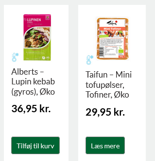
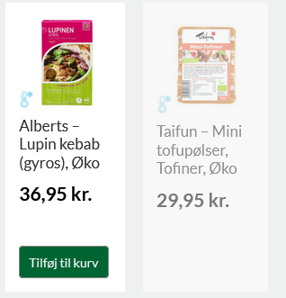

# userscripts

My userscripts, for public use

## scripts:

[`greenos.user.js`](./userscripts/greenos.user.js)   
The danish vegan webshop GreenOS merged their code with nuttyvegan, with the 
unfortunate result that it became nigh impossible to see if a product was in
stock, or not.   
   
   
The script is rather simple, as it just adds a small CSS at the head of the page
resulting in the removal of the 'read more' button, and the fading out of the
tile.   
If the tile doesn't have a background color, it will also apply the 
'darkslategray' color to it.

The script is set up to only run on (https://greenos.dk) and 
(https://nuttyvegan.dk), but will probably work on all woo-commerce sites.